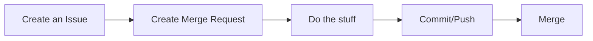

# Claims

## Goals

- easy, fast and secure way of storing and verifying the claims; for example ownerships, rental agreements ...
- file system agnostic
- inter-planetary available
- blockchain technology agnostic
- easily provable by anyone without revealing the claim content

## Properties

- `id`: String [Content ID](https://github.com/multiformats/cid) String - A one-way, deterministic cryptographic hash of the contents. it serves as content hash ID as well
- `version`: Integer - version of the document
- `claim`: Claim - Claim type
- `issuanceDate`: Date - when it's issued
- `issuer`: Issuer
- `publisher`: Publisher

## Structure

```json
{
  "id": "bafybiqcrcaftp3vbaytf4tcn7lmid3b4wbyy4nv7z2iwj4oeh7wdpomeprg4r2v32qxe2cjdvbrwktqfnu4pwgry3qlnrlbtfpztfrdovxpi6",
  "version": 1,
  "claim": {
    "hash": "8tUTPu1naqEtYR9Z52df1DqMejKc1yWD1AxrV6Vu7FBu14cLwJc5jmaeMsxgNTcmuW5ksXddM4G7jZoCyCVcquMsMC",
    "author": {
      "fingerprint": "73f19d67792965048553e0c141aa33c900e83a41",
      "signature": "z9JJbwGmuL8pr6pqe9XJjSSNkvKkcijbiJi54xCN8tDmQGijyDSyE5RDJrceQTHBRm1Ktx7U3sxCwQ7nRgaACeLo2QaT5oCRQtYNcNtug9boL6dChHqaqZkTYvTjPoVzFATh8tJaeZCQrMYXnaAu7iApuXcegXM3TPYsqvDk3uKMVyFABbFNkeQSiGZA4PTdH8J2vtzN4gBiiyjSNHGVL6XqqrEqApjMfbjwz8LmqSsDkPFhDmw5DkSZNcSFT9TdvriySm4CpkZ9shEULhQaQeGcVUZUdhmZRkKM5MCvxs7146nLCiX3va4jc5xPJkuq9dSPxbtTaTjP91jWcDCp4gzSx7WHt2Emm8bZSJD53pQf9ouak4kKJ8jChrxVmd9pMQWeqPhcTWaS468kb2EwZXDe9PTHJtZB8QudkPUtVujnE3SiECJUmDqWBmAsm9pyuetwvByu3Vykkf3M8XQX2d3373P4NP9BrgQDFSpP2UdozAS5VwxzHXnKxs6vwgTgJ1Kt2y7XgJUeno9J1ei61RjziA5WiA7qUQ7rzZC4AaXC2gjXdoJDQ1gHFtRYKzsNS8zpTh4JuqrDsBou3dBixbjWACiCnTgJzs2u1vj8uy56hdpKoaC2E5qLRPXmARWYLbp6icDUsimhwW5YD6kyEMKURxdoeh7GmtbSQ58TsGYPXgmVxBPgVLhWgcbyTsF",
      "signature_cid": "bafybiqhjduf63felgf7cwsow5nzrvz4heid4x6p3zj6wma7okooju6pexgvqll3bet7djddpmtswksfzete6h2ozdep77jhqdcmodjslxkyve"
    },
    "shares": { "unit": "percentage", "symbol": "%", "value": "100" },
    "canonicalUrl": "https://explorer.sensio.id/claims/8tUTPu1naqEtYR9Z52df1DqMejKc1yWD1AxrV6Vu7FBu14cLwJc5jmaeMsxgNTcmuW5ksXddM4G7jZoCyCVcquMsMC",
    "type": "ownership"
  },
  "issuanceDate": "2018-10-12T01:54:11.559Z",
  "issuer": {
    "fingerprint": "2aa006aab172ba3e83a789145244296e8b31ae48",
    "signature": "z9JJbwGmuL8pr6pqe9XJjSSNkvKkcijbiJi54xCN8tDmQGijyDSyE5RDJrceQTHBRm1Ktx7U3sxCwQ7nRgaACeLo2QaT5oCRQtYNcNtug9boL6dChHqaqZkTYvTjPoVzFATh8tJaeZFq5dLN8ZpS1CZ5kVrPWYTmrUZeSn4j8JQyhqKKpdr2Houd3MscHUtBMvWzkAWiUyuw3P77E8tD5Cd6edMPyEebt4aRjXBLV8QJtLLNzpzVMa3oaWsepDZHaCSBJG9dwRG4KdP3a6z2Krk7Az3AEAAejRW4a7M3LjbYi1cYCaraYvFW5KDcbWEKnUBf9sfK7GUabuypgVUYBs6HbjXxmLixCKuaEfw9prDY6T43g5rVdTUC85L9xp5qYbDJc1DU3yVq12KSgqNSncYgRQ4y1ZcACYUSiBcuDQPEJsniRNd8hv9zUJmQq3RadyD46ai8ThKckBU82ZK4yvsvMi5JE9WXBr5hq2vhRKS9bsoemLy91zna6je1juCeGFdwGVJnwt3WdXdNFZ4AXB4gEWzHk4EBitesBRGsVhx2zzkYGwvJL1GZEEsKnLoUyHh2f1mmbQwzk8WJuEyR41ejfysEDUCgvcZk65YCcmCBSC7Ehu6SkFUBxEfqyRzBZyAKPL1ez2GoJVVVrw5Wdd6NW9zSqgBG6kHQV4vGdEjHvRUY6viyhMWZP3E2wjw",
    "signature_cid": "bafybiqa5qii6inawjxnwdmiunmalzwfkac3xxhrnu3magnrwadtfufbjm2wynye5xb3yyk26agdoxndbwyew3fpktvq7kvnsb6qdmgqeidk2s"
  },
  "publisher": {
    "fingerprint": "878e0f89f21d32a9e7797e1c21920a355c26d7a3",
    "signature": "z9JJbwGmuL8pr6pqe9XJjSSNkvKkcijbiJi54xCN8tDmQGijyDSyE5RDJrceQTHBRm1Ktx7U3sxCwQ7nRgaACeLo2QaT5oCRQtYNcNtug9boL6dChHqaqZkTYvTjPoVzFATh8tJaeZFq5dLN8ZpS1CZ5kVrPWYTmrUZeSn4j8JQyhqKKpdr2Houd3MscHUtBMvWzkAWiUyuw3P77E8tD5Cd6edMPyEebt4aRjXBLV8QJtLLNzpzVMa3oaWsepDZHaCSBJG9dwRG4KdP3a6z2Krk7Az3AEAAejRW4a7M3LjbYi1cYCaraYvFW5KDcbWEKnUBf9sfK7GUabuypgVUYBs6HbjXxmLixCKuaEfw9prDY6T43g5rVdTUC85L9xp5qYbDJc1DU3yVq12KSgqNSncYgRQ4y1ZcACYUSiBcuDQPEJsniRNd8hv9zUJmQq3RadyD46ai8ThKckBU82ZK4yvsvMi5JE9WXBr5hq2vhRKS9bsoemLy91zna6je1juCeGFdwGVJnwt3WdXdNFZ4AXB4gEWzHk4EBitesBRGsVhx2zzkYGwvJL1GZEEsKnLoUyHh2f1mmbQwzk8WJuEyR41ejfysEDUCgvcZk65YCcmCBSC7Ehu6SkFUBxEfqyRzBZyAKPL1ez2GoJVVVrw5Wdd6NW9zSqgBG6kHQV4vGdEjHvRUY6viyhMWZP3E2wjw",
    "signature_cid": "bafybiqa5qii6inawjxnwdmiunmalzwfkac3xxhrnu3magnrwadtfufbjm2wynye5xb3yyk26agdoxndbwyew3fpktvq7kvnsb6qdmgqeidk2s"
  }
}
```

The `id` field is the [Content ID](https://github.com/multiformats/cid). It is generated by hashing the whole object except the `id` field using `sha3-512` algo and then generating the `dag-pb` version of `CID`

Example of is located [here](https://runkit.com/woss/simple-generation-of-content-addressed-identifiers-cid).

# Creative Work Claim Type

The Creative Work claim type is a backbone of the SensioID claims ecosystem. Most other claims in the ecosystem will reference a creative work. The most generic kind of creative work, including books, movies, photographs, software programs, etc.

The purpose of the Creative Work claim type is to standardize the format for all the claims, to anchor the data to blockchain and give insight into owners rights and restrictions

## Properties

- `hash`: String [Content ID](https://github.com/multiformats/cid) String - A one-way, deterministic cryptographic hash of the claim payload.
- `type`: String - The type of the creative work. Options: [ownership]
- `author`: [Data URI](https://en.wikipedia.org/wiki/Data_URI_scheme)- A reference to the author of the creative work.
- `contributors`?: Array of URIs - References to contributors. -- @TODO
- `tags`?: Array of Strings - Indexable keywords related to the work.
- `license`?: URI - A reference to license terms granted to users of the creative work.
- `dateCreated`?: ISO 8601 String - The date the work was created on.
- `canonicalUrl`?: URL String - An "official" location to be used as a homepage for the Creative Work in links or citations.

### Example

```json
{
  "hash": "8tUTPu1naqEtYR9Z52df1DqMejKc1yWD1AxrV6Vu7FBu14cLwJc5jmaeMsxgNTcmuW5ksXddM4G7jZoCyCVcquMsMC",
  "license": "https://license.uri.which.can.not.be/changed",
  "author": "https://woss.sensio.id/",
  "canonicalUrl": "https://explorer.sensio.id/claims/8tUTPu1naqEtYR9Z52df1DqMejKc1yWD1AxrV6Vu7FBu14cLwJc5jmaeMsxgNTcmuW5ksXddM4G7jZoCyCVcquMsMC",
  "dateCreated": "2019-01-02T00:00:00.000Z"
}
```

## How to write the wiki

This wiki is written in [Markdown](https://www.markdownguide.org/getting-started/), a lightweight markup language that you can use to add formatting elements to plaintext text documents.

Getting Started with [markdown](https://www.markdownguide.org/getting-started/) and [with diagrams in markdown](https://mermaidjs.github.io/#/)

## Contribution Workflow

The following flow is used, for now.



## Get Support

[General Chat](https://discord.gg/UYhBDRy)

## Security

Find out how to [report security issues or bugs](security.md) to Sensio development team.

## Links

- <https://github.com/mgmtio/video-phash-service>
- <https://sofa-api.com/>
- <https://geekflare.com/nodejs-security-scanner/>
- <https://dask.org/> _machine learning_
- <https://democracy.earth/>
- <https://population.un.org/wpp/>
- <https://www.mycryptopedia.com/ewasm/>
- <https://akropolis.io/#products>

```typescript
// https://opentimestamps.org/info/?004f70656e54696d657374616d7073000050726f6f6600bf89e2e884e892940108c349b4296015ff49ca89511eedde9c98a05a9edf12f83f8f1a5af2cd08c14b2af010be1724df288ae7025aa9c5e129345d8d08fff01015657532cd9cbf1feb475f9519ab184508f1045cefd262f0088b3fe46a0b71737c0083dfe30d2ef90c8e2e2d68747470733a2f2f616c6963652e6274632e63616c656e6461722e6f70656e74696d657374616d70732e6f7267fff010b96dd2512a8d459285a5aa336540080c08f0107a09e0ec0b97b2d2d33603c175e0e1d808f1045cefd262f0080fdd8dd5f42275de0083dfe30d2ef90c8e292868747470733a2f2f66696e6e65792e63616c656e6461722e657465726e69747977616c6c2e636f6dfff010d88c1d4469b025652310c56edc9f054508f1045cefd263f0081638f522af89d2cb0083dfe30d2ef90c8e232268747470733a2f2f6274632e63616c656e6461722e636174616c6c6178792e636f6df010db28532737c71b0fadd81f4f6296c71c08f1045cefd262f00877d36b76689639470083dfe30d2ef90c8e2c2b68747470733a2f2f626f622e6274632e63616c656e6461722e6f70656e74696d657374616d70732e6f7267
interface CameraContentPayload {
  maker: string; // xmp:Make
  model: string; //xmp:Model
  serialNumber: string; // xmp:SerialNumber
}
function generateCameraContentHash(payload: CameraContentPayload) {
  contentHash = sha3(payload);
}
```

## Future

- [ ] crypto Keys for every person, wide adoption
- [ ] promote FIDO hard keys like Yubikey
- [ ] integrations with Identity Provider services like Auth0/Blockstack
- [ ] verifiable human through Keybase
- [ ] verifiable claims of ownerships/rentals/purchases
- [ ] distributed and publicly available proof of claims
- [ ] privacy/security/transparency by default
- [ ] users own their data
- [ ] full encryption of every item
- [ ] DApp
- [ ] bring your own storage


## Etymology and definition

> Noun
>
> [sēnsiō](<(https://en.wiktionary.org/wiki/sensio)>) (genitive sēnsiōnis); third declension
>
> (rare) thought

History and Etymology for thought

> Middle English, from Old English thōht;

# Ownership Claim Type

Ownership claim type extends the Creative Work Claim type.

## Properties

- `shares`: [String](../glossary.md#shares) - Conditions of the ownership.
- `type`: String - Value is `ownership`

### Example

Alice owns the **Canon 750D** camera and the **Canon 18m-135m IS USM** lens that she uses to take most of the pictures.
She used the [SOP](../glossary.md#sensio-ownership-flow) to verify the fact that she owns the equipment.
SensioID generates the claim of the ownership with the 100% ownership.

```json
{
  "hash": "8tUTPu1naqEtYR9Z52df1DqMejKc1yWD1AxrV6Vu7FBu14cLwJc5jmaeMsxgNTcmuW5ksXddM4G7jZoCyCVcquMsMC",
  "author": "https://alice.sensio.id/",
  "canonicalUrl": "https://explorer.sensio.id/claims/8tUTPu1naqEtYR9Z52df1DqMejKc1yWD1AxrV6Vu7FBu14cLwJc5jmaeMsxgNTcmuW5ksXddM4G7jZoCyCVcquMsMC",
  "dateCreated": "2019-01-02T00:00:00.000Z",
  "type": "ownership",
  "shares": [{ "unit": "percentage", "symbol": "%", "value": 100 }]
}
```


# About Sensio Identity (SensioID)

> SensioID is a hybrid [DID](definitions.md#did) and KeyManager fot (de)centralized PKI.

# must read

- https://github.com/decentralized-identity/sidetree/blob/master/docs/protocol.md
- https://github.com/blockstack/blockstack-core/blob/master/docs/blockstack-did-spec.md
- https://www.npmjs.com/package/distributed-ids
- https://w3c-ccg.github.io/ld-cryptosuite-registry/
- https://github.com/decentralized-identity/element
- https://element-did.com/server/info
- https://w3c-ccg.github.io/did-spec/
- https://opencreds.org/specs/source/identity-credentials/#expressing-an-identity
- https://browser.blockstack.org/

My DID on ELEMENT-did.com

`did:elem:BMsJRQxYaZyjlryswMM18XLrCcqZbdLkd68s8Lrj_tA`

My DID on blockstack
`woss.id.blockstack` and `ID-1H291YHCzQFq369ggaxdUtU3bGUtZvFgzV`

# About Sensio Photo

all encrypted by default

# Discovery

since all content is encrypted by default we must ask the user to allow us to use certain information about the photo/video/text unencrypted for search and analytics.

# Challenges

## When the user shares the photo how do we tackle decryption?

One way is that it is encrypted with the pub key of the receiving user. If it is intended for multiple users then maybe use a shared key???

## Graphql With encrypted stuff

## How to solve the issue with 3rd party services getting the tags for encrypted photo

## Decrypting on the client-side and still use GraphQL
