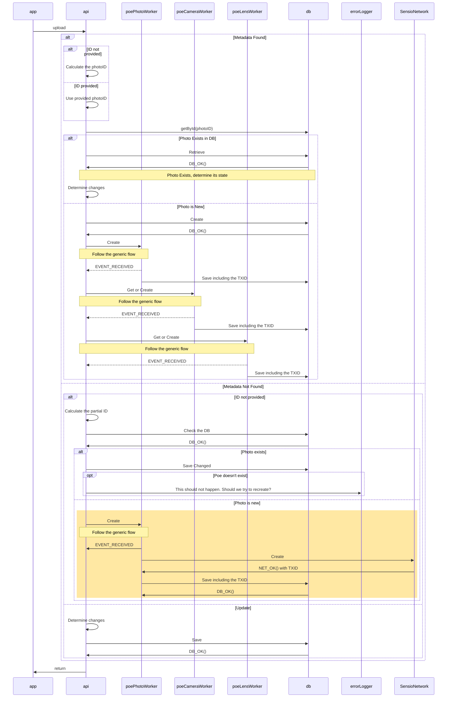

# Api and PoE

```mermaid
sequenceDiagram
  participant app
  participant api
  participant poePhotoWorker
  participant poeCameraWorker
  participant poeLensWorker
  participant db
  participant errorLogger

  app->>api: upload


  alt Metadata Found
    alt ID not provided
      api->>api: Calculate the photoID
    else ID provided
      api->>api: Use provided photoID
    end

    api->>db: getById(photoID)

    alt Photo Exists in DB
      api->>db: Retrieve
      db->>api: DB_OK()
      note over api,db: Photo Exists, determine its state


      api->>api: Determine changes

    else Photo is New
      api->>db: Create
      db->>api: DB_OK()

      api->>poePhotoWorker: Create
      note over api,poePhotoWorker: Follow the generic flow
      poePhotoWorker-->>api: EVENT_RECEIVED
      poePhotoWorker->>db: Save including the TXID


      api->>poeCameraWorker: Get or Create
      note over api,poeCameraWorker: Follow the generic flow
      poeCameraWorker-->>api: EVENT_RECEIVED
      poeCameraWorker->>db: Save including the TXID

      api->>poeLensWorker: Get or Create
      note over api,poeLensWorker: Follow the generic flow
      poeLensWorker-->>api: EVENT_RECEIVED
      poeLensWorker->>db: Save including the TXID

    end

  else Metadata Not Found

      alt ID not provided
        api->>api: Calculate the partial ID
        api->>db: Check the DB
        db->>api: DB_OK()
        alt Photo exists
          api->>db: Save Changed
          opt Poe doesn't exist
            api->>errorLogger: This should not happen. Should we try to recreate?
          end
        else Photo is new
         rect rgb(255, 232, 163)
            api->>poePhotoWorker: Create
            note over api,poePhotoWorker: Follow the generic flow
            poePhotoWorker->>api: EVENT_RECEIVED
            poePhotoWorker->>SensioNetwork: Create
            SensioNetwork->>poePhotoWorker: NET_OK() with TXID
            poePhotoWorker->>db: Save including the TXID
            db->>poePhotoWorker: DB_OK()
          end
        end
      else Update
        api->>api: Determine changes
        api->>db: Save
        db->>api: DB_OK()
      end

  end
  api->>app: return

```
