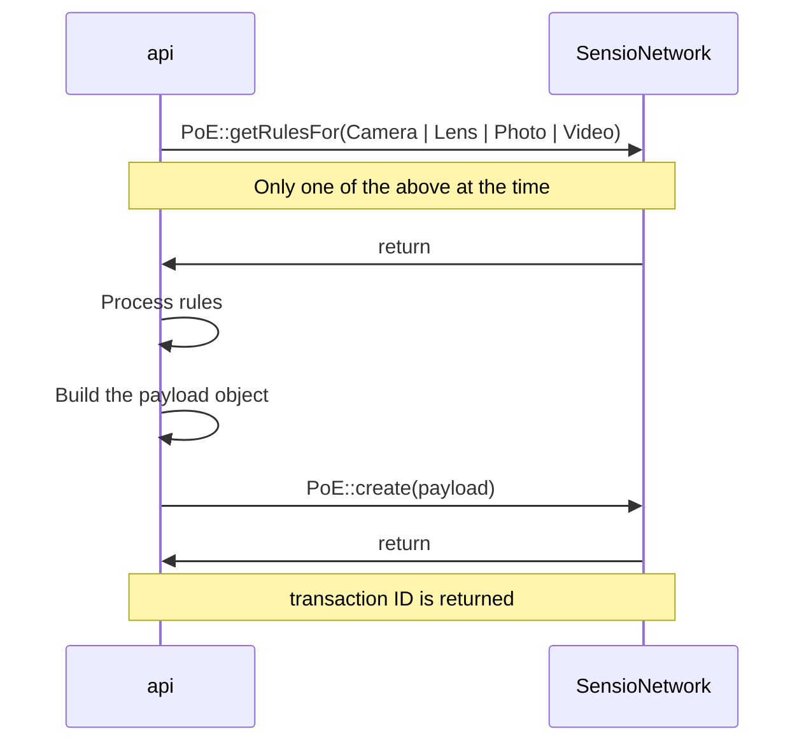
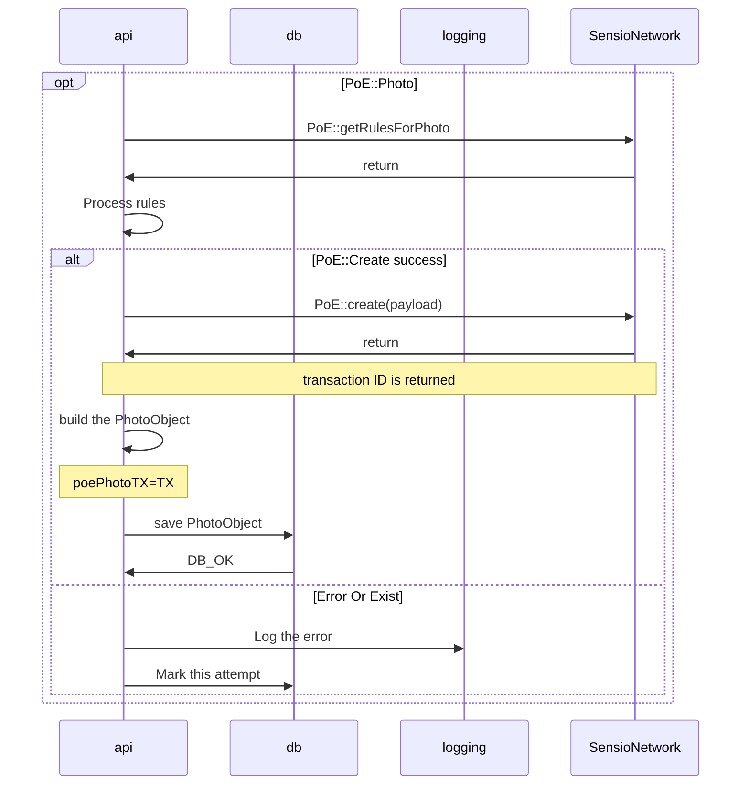

# Generic diagrams

```mermaid
sequenceDiagram

  api->>SensioNetwork: PoE::getRulesFor(Camera | Lens | Photo | Video)
  note over api,SensioNetwork: Only one of the above at the time
  SensioNetwork->>api: return

  api->>api: Process rules
  api->>api: Build the payload object

  api->>SensioNetwork: PoE::create(payload)
  SensioNetwork->>api: return
  note over SensioNetwork,api: transaction ID is returned
```

# Example for Getting the PoE for the Photo

```mermaid
sequenceDiagram
  participant api
  participant db
  participant logging
  participant SensioNetwork

  opt PoE::Photo
    api->>SensioNetwork: PoE::getRulesForPhoto
    SensioNetwork->>api: return


    api->>api: Process rules

    alt PoE::Create success

        api->>SensioNetwork: PoE::create(payload)

        SensioNetwork->>api: return
        note over SensioNetwork,api: transaction ID is returned

        api->>api: build the PhotoObject
        note over api,api: poePhotoTX=TX

        api->>db: save PhotoObject
        db->>api: DB_OK
    else Error Or Exist
      api->>logging: Log the error
      api->>db: Mark this attempt
    end
  end
```
