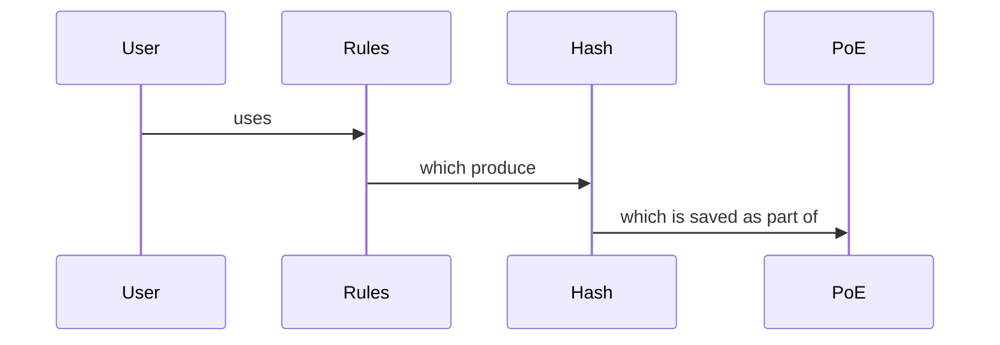

# Generic rule exec

User uses the rules to create Hash which is stores as a PoE

```mermaid
sequenceDiagram
  participant User
  participant Rules
  participant Hash
  participant PoE

  User ->> Rules: uses
  Rules ->> Hash: which produce
  Hash ->> PoE: which is saved as part of


```
