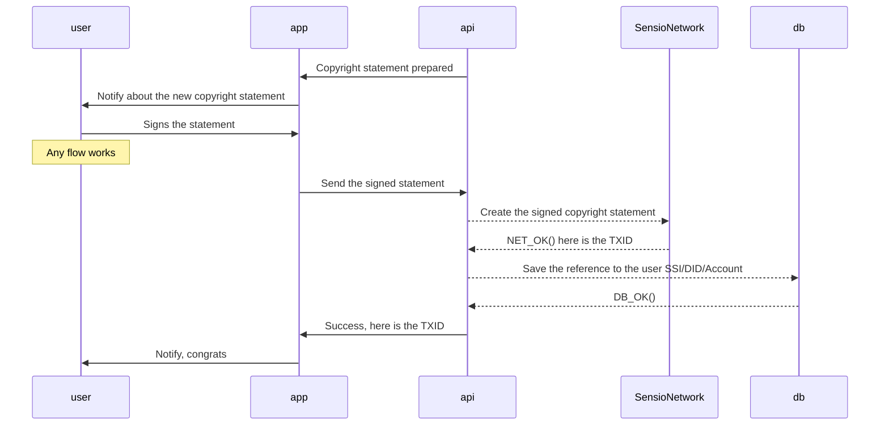

# Claiming the Copyright

After successful [**PoCLO**](./camera-lens-verification.md) we are ready to claim the [copyright](../glossary.md#copyright) of the photo. For now it is a straightforward process of signing the generated statement.
System will prepare the statement for us after we sign the statement of ownership, in another words, when we claim the ownership. We will be notified (email, push, notification in the web ui) that we have to sign the copyright statement with out private key which is located either in the browser, phone, or any other super secure place. When we sign the statement and send it using the webapp, we will receive notification that we have claimed the copyright which we can examine using provided link. Now we are ready to sell the licenses and transfer the copyright.

Diagram:

